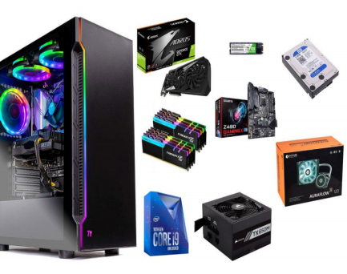
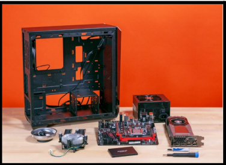
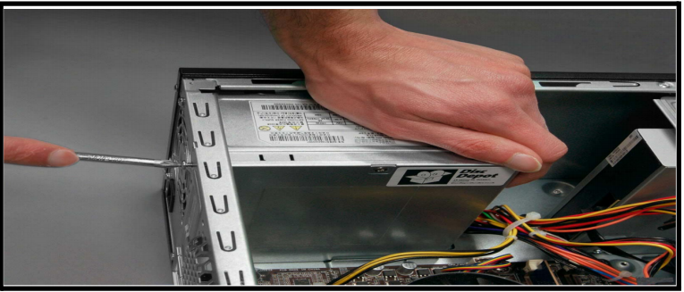
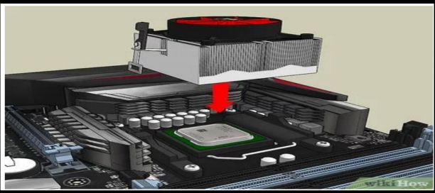
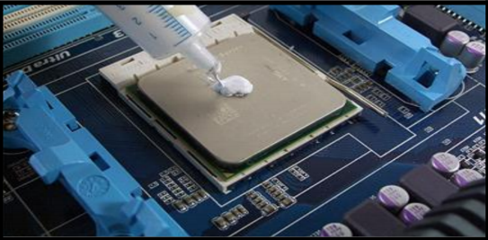
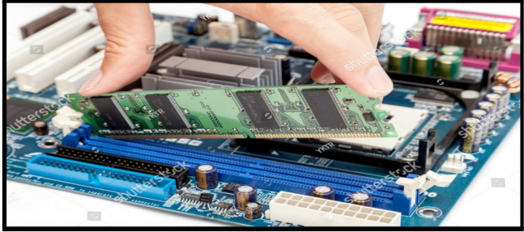
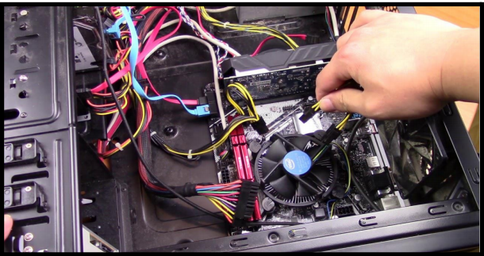
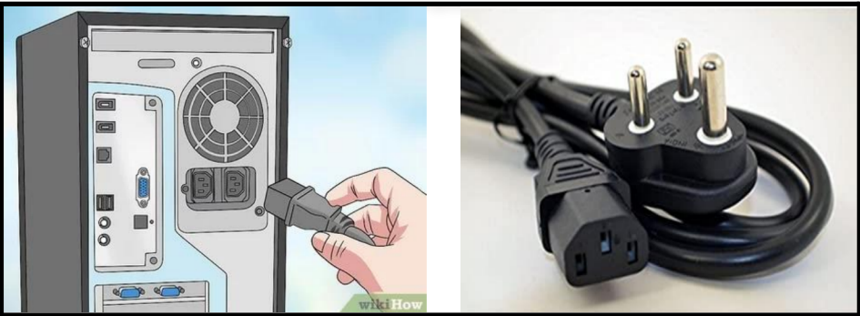
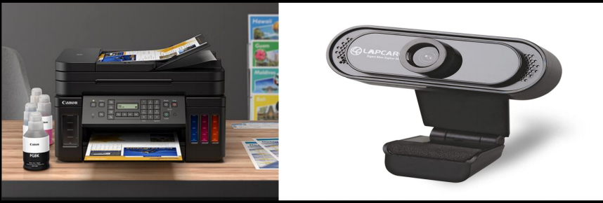

# OS-EX-1-Assembling-the-System---CASE-STUDY

### AIM:
To assemble the Computer System.
### MATERIALS REQUIRED :
1. Computer Case, With Power Supply Installed  
2. Motherboard 
3. CPU 
4. Heat Sink/Fan Assembly
5. Thermal Compound 
6. RAM Module(s) 
7. Motherboard Standoffs And Screws 
8. Anti-static Wrist Strap And Anti-static Mat
9. Tool Kit 

 
### STEPS :
1. Open The Case 
2. Install The Power Supply 
3. Attach The Components To The Motherboard 
4. Install The Motherboard 
5. Install Internal Drives 
6. Connect All Internal Cables 
7. Install Motherboard Power Connections 
8. Connect External Cables To The Computer 
9. Boot The Computer For The First Time.

## PROCEDURE FOR COMPUTER ASSEMBLING : 
### Step 1: Open The Case

The First Step In Assembling A Computer Is To Open The Computer Case. To Open The Case, First Remove The Screws Of The Left Side Cover And Slide The Side Cover.
### Step 2: Install The Power Supply

The Next Step Is To Install A Power Supply. There Are Usually Four Screws That Attach The Power Supply To The Case.  
### Step 3: Attach The Components To Motherboard

The Motherboard Has To Be Prepared Before Its Installation. To Prepare The Motherboard, You First Need To Install The CPU, Then 
The Heat Sink On The CPU And CPU Fan. 
#### 1. CPU :

A CPU Socket Uses A Series Of Pins To Connect A CPU’s Processor To The Pc’s Motherboard. If A CPU Is Connected Via A CPU Socket.
#### 2. Heat sink and fan assembly :

A Heat Sink And Fan (HSF) Is An Active Cooling Solution Used To Cool Down Integrated Circuits In Computer Systems, Commonly The Central Processing Unit (CPU).
#### Connect The Assembly Power Cable To The CPU Fan Connector On The Motherboard.

#### 3. Installation of RAM :

To Install The RAM First On The Motherboard And Then Fix The Motherboard In The Case. To Install RAM, First Ensure Its Compatibility With The Motherboard.
### Step 4: Install motherboard

After Preparing The Motherboard, You Can Install In The Computer Case.
### Step 5: Install internal drives
#### 1. HARD DRIVES :

The Hard Drive Is The Device Which Stores All The Data. Connect The Power Cable Coming From The SMPS To The Power Socket Of Hard Disk Drive. Connect SATA Data Cable From Hard Disk Drive Socket To The Motherboard Socket.
### Step 6: Connect all internal cables

Power Cables Are Used To Distribute Electricity From The Power Supply To The Motherboard And Other Components. Data Cables Transmit Data Between The Motherboard And Storage Devices, Such As Hard Drives.
### Step 7: Install motherboard power connections  

The Advanced Technology Extended (ATX) Main Power Connector Will Have Either 20 Or 24 Pins.
### Step 8: Connect external cables to the computer
#### 1. Connecting Monitor :

The VGA Cable Is Used To Connect To Monitor.
#### 2. Connecting Keyboard :

If It Uses A USB Connector, Plug It Into Any Of The USB Ports On The Back Of The Computer.
#### 3. Connecting Headphones Or Speakers, And Microphone :

Connect The External Speakers Or Headphones, To Computer’s Audio Port (Either On The Front Or Back Of The Computer Case).               
#### 4. Connect The Computer To A Power Supply :

Power Supply Cable Connect Into The Back Of The Computer Case.
#### 5. Connecting Printer, Scanner, Webcam 

### Step 9: Starting the computer         

Always Remember That The First Step Is To Push Power Button Of The CPU Than The Monitor’s. An Operating System Or System Software Like Window Or Linux Will Start Loading, Now Your Computer Is Ready To Use.
### RESULT:
The computer system successfully assembled. 